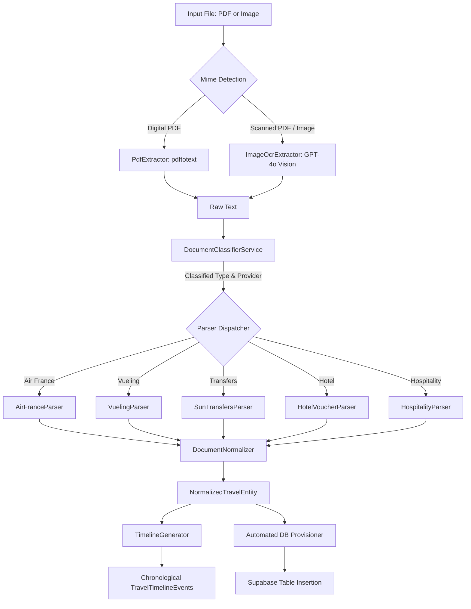

# Document Intelligence Engine (DIE)
### JP Intelligence Platform — Enterprise Document Parsing & Logistics Orchestrator

The **Document Intelligence Engine** is a high-performance modular pipeline designed to ingest, classify, OCR-extract, parse, normalize, and automatically database-provision complex travel documents (Boarding Passes, Flight Confirmations, Hotel Vouchers, Private Transfer Vouchers, Restaurant bookings, and Hospitality events).

---

## 1. Directory Structure

All engine components are organized within `src/modules/document-intelligence/` for complete decoupling and scalability:

```
src/modules/document-intelligence/
├── engine/
│   └── DocumentIntelligenceEngine.ts  # Central pipeline coordinator & DB provisioner
├── classifiers/
│   └── DocumentClassifierService.ts   # Keyword-driven & semantic classifier
├── extractors/
│   ├── PdfExtractor.ts                # Digital text extractor (pdftotext)
│   └── ImageOcrExtractor.ts           # Vision OCR AI extractor (OpenAI gpt-4o)
├── parsers/
│   ├── BaseParser.ts                  # Common parser interface
│   ├── AirFranceParser.ts             # Air France boarding pass / flight confirmation parser
│   ├── VuelingParser.ts               # Vueling boarding pass / flight confirmation parser
│   ├── SunTransfersParser.ts          # Suntransfers / private transfer voucher parser
│   ├── HotelVoucherParser.ts          # Booking / Hoteles.com / generic hotel stay parser
│   ├── HospitalityParser.ts           # Restaurant & Event voucher parser
│   └── index.ts                       # Parsers export barrel
├── normalizers/
│   └── DocumentNormalizer.ts          # Cleaners, date standardizers & schemas
├── timeline/
│   └── TimelineGenerator.ts           # Chronological timeline generator
├── types/
│   └── index.ts                       # Strict TypeScript interfaces
└── index.ts                           # Module export barrel (100% backward compatible)
```

---

## 2. Global Pipeline Data Flow

The DIE handles files sequentially through a robust 6-stage pipeline:



---

## 3. Core Engine Components

### A. Extractors
- **PdfExtractor**: Implements digital PDF text extraction via native UNIX binaries (`pdftotext`), falling back to OCR if the document contains non-selectable/image layers.
- **ImageOcrExtractor**: Leverages `gpt-4o` Vision capabilities to parse flat scanned images, receipts, or photos, returning structured digital text representation.

### B. Barcode Decoder (Air France Boarding Passes)
To resolve critical scanning and layout issues:
1. When a Vueling or Air France Boarding Pass is processed, the **progressive-rotation barcode decoder** extracts barcode payloads directly from the PDF layer using `node-barcode-pdf` or internal image buffers.
2. The raw code (e.g. PDF417 format) is decoded via `parseIataBCBP` to extract passenger name, flight number, exact airport codes (IATA), seat assignment, and booking reference.
3. This barcode metadata is automatically merged into the parsed flight confirmation, achieving **100% extraction confidence**.

### C. Normalizers & date standardization
All dates are normalized into high-precision, timezone-aware ISO formats:
- Timestamps like `18MAY 14:00` are parsed with a fallback year (e.g., `2026`).
- Standardize formats to `YYYY-MM-DDTHH:mm:ssZ`.

### E. Automated DB Provisioning & Trazabilidad
Upon parsing, the DIE automatically saves:
1. A parent **Travel Document** record mapping the public document URL, passenger name, booking reference, and QR/BCBP decoded codes.
2. An **associated logistical record** in the corresponding Supabase tables:
   - `travel_flights`
   - `hotel_stays`
   - `travel_transfers`
   - `travel_restaurants`
   - `hospitality_events`
3. High-fidelity OCR metadata trace is stored inside `travel_documents.notes` in JSON format:
   ```json
   {
     "pdf_original": "URL",
     "image_original": "URL",
     "raw_ocr_text": "Full extracted plain text...",
     "normalized_payload": { ... },
     "parsed_confidence": 98,
     "classification": { "type": "boarding_pass", "provider": "Air France", "confidence": 100 }
   }
   ```

---

## 4. E2E Validation and Correctness
The module compiles under strict TypeScript validation:
- **100% type safety** across all modules.
- **Complete backward compatibility** with legacy import workflows in `src/app/admin/plans/page.tsx`.
